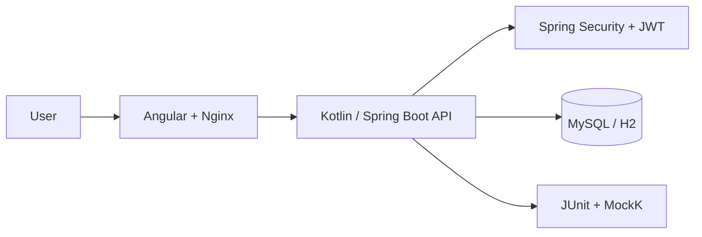

<div align="center">

**English** | [Português](README.pt-BR.md)

# OpsGuard Platform

**Full-stack organization, collaborator and device management with secure tenant isolation.**

</div>

The platform combines a Kotlin/Spring Boot API, an Angular SPA and a Docker Compose environment designed for reproducible execution on Windows, Linux and macOS.

## Architecture



## Main capabilities

- Authentication for `MANAGER` and `OPERATOR` profiles
- CRUD operations for organizations, collaborators and devices
- Backend-enforced tenant isolation for operators
- Validation in the browser, API and database layers
- OpenAPI documentation available only when explicitly enabled
- Responsive interface for desktop, tablet and mobile devices
- Docker containers running as non-root users

## Technology stack

| Layer | Technology |
| --- | --- |
| Frontend | Angular 21.2, TypeScript 5.9 and RxJS |
| Backend | Kotlin 2.1, Spring Boot 3.4 and Spring Security |
| Authentication | HMAC-SHA256 JWT and BCrypt 12 |
| Persistence | Spring Data JPA, Hibernate and Flyway |
| Databases | MySQL 8.4 in Docker and in-memory H2 for local development |
| Documentation | Springdoc OpenAPI |
| Infrastructure | Docker Compose and unprivileged Nginx |
| Tests | JUnit 5, MockK and Spring Test |

## Quick start with Docker

### Requirements

- Docker Desktop or Docker Engine with Docker Compose v2
- Git

### Configure the environment

```bash
git clone https://github.com/samuelhfdias-prog/Teste-Rodojacto.git
cd Teste-Rodojacto
cp .env.example .env
```

PowerShell:

```powershell
Copy-Item .env.example .env
```

Replace every value beginning with `troque-` in `.env`. Generate a Base64 JWT key with at least 256 bits:

```bash
openssl rand -base64 32
```

The `.env` file is ignored by Git and must never be committed.

### Start the application

```bash
docker compose up --build -d
docker compose ps
```

| Service | Address |
| --- | --- |
| Web application | http://localhost:4200 |
| API health check | http://localhost:8080/api/health |
| Swagger, when enabled | http://localhost:8080/swagger-ui.html |
| MySQL | `127.0.0.1:3307` |

```bash
docker compose logs -f backend frontend
docker compose down
```

Use `docker compose down -v` only when you also want to permanently remove local database data.

## Local development

### Requirements

- JDK 21 available through `JAVA_HOME` or `PATH`
- Node.js 22 LTS
- npm 10 or newer

The official Gradle wrapper is included.

Backend on Windows:

```powershell
cd backend
.\gradlew.bat bootRun
```

Backend on Linux or macOS:

```bash
cd backend
chmod +x gradlew
./gradlew bootRun
```

The local profile uses in-memory H2, applies Flyway migrations and enables demonstration data.

Frontend:

```bash
cd frontend
npm ci
npm start
```

Open http://localhost:4200. The development proxy forwards `/api` requests to the local backend.

### Local-only demonstration accounts

| User | Password | Role |
| --- | --- | --- |
| `manager@opsguard.dev` | `Manager@123` | MANAGER |
| `operator1@opsguard.dev` | `Operator@123` | OPERATOR |
| `operator2@opsguard.dev` | `Operator@123` | OPERATOR |

Docker obtains passwords from `SEED_MANAGER_PASSWORD` and `SEED_OPERATOR_PASSWORD`. Demonstration seeding must remain disabled in production.

## Environment variables

| Variable | Required in Docker | Purpose |
| --- | :---: | --- |
| `MYSQL_PASSWORD` | Yes | MySQL application-user password |
| `MYSQL_ROOT_PASSWORD` | Yes | MySQL administrative password |
| `JWT_SECRET_KEY` | Yes | Base64 key used to sign JWTs |
| `JWT_EXPIRATION_MS` | No | Token lifetime; one hour by default |
| `SEED_DATA_ENABLED` | No | Enables demonstration users and data |
| `SEED_MANAGER_PASSWORD` | With seed | Demonstration manager password |
| `SEED_OPERATOR_PASSWORD` | With seed | Demonstration operator password |
| `SWAGGER_ENABLED` | No | Enables OpenAPI/Swagger; `false` in Docker by default |
| `CORS_ALLOWED_ORIGINS` | No | Comma-separated origins allowed to access the API |
| `APP_LOG_LEVEL` | No | Application log level; `INFO` by default |
| `SHOW_SQL` | No | Logs SQL in the local profile when `true` |

External ports can be changed through `MYSQL_HOST_PORT`, `BACKEND_HOST_PORT` and `FRONTEND_HOST_PORT`.

## API overview

Authentication:

```http
POST /api/auth/login
Content-Type: application/json

{
  "email": "manager@opsguard.dev",
  "password": "your-password"
}
```

Send the returned token through `Authorization: Bearer <token>`.

| Method | Route | Purpose |
| --- | --- | --- |
| GET | `/api/organizations` | List allowed organizations |
| GET | `/api/organizations/{id}` | Retrieve one organization |
| POST | `/api/organizations` | Create an organization; MANAGER only |
| PUT | `/api/organizations/{id}` | Update an organization; MANAGER only |
| DELETE | `/api/organizations/{id}` | Delete an organization; MANAGER only |
| GET/POST | `/api/collaborators` | List or create collaborators |
| GET/PUT/DELETE | `/api/collaborators/{id}` | Read, update or delete a collaborator |
| GET/POST | `/api/devices` | List or create devices |
| GET/PUT/DELETE | `/api/devices/{id}` | Read, update or delete a device |
| GET | `/api/health` | Public health check |

### Access control

| Operation | MANAGER | OPERATOR |
| --- | :---: | :---: |
| View organizations | All | Own organization only |
| Create, update or delete organizations | Yes | No |
| View collaborators and devices | All | Own organization only |
| Create collaborators and devices | Any organization | Own organization only |
| Change data from another organization | Yes | No; returns HTTP 403 |

Authorization is enforced by backend services. Hiding interface controls is only a user-experience improvement and is not the security boundary.

## Security highlights

- JWTs include a required issuer, expiration, unique identifier and external Docker key
- Passwords are stored with BCrypt factor 12
- Temporary lockout after five failed login attempts for an email in 15 minutes
- Uniform invalid-credential responses that do not reveal registered users
- Consistent JSON responses for HTTP 401, 403, 409, 422 and 429
- Restricted and configurable CORS
- Input size, format, required-field and positive-ID validation
- Input normalization before persistence
- CSP, `frame-ancestors`, `nosniff`, referrer and permission headers in Nginx
- Non-root frontend and backend containers
- Database exposed only through `127.0.0.1` by default
- Swagger and demonstration data disabled by default in Docker
- Secrets and environment files excluded from Git

For production, terminate TLS at the proxy or load balancer, store secrets in a vault, restrict direct API access and use a distributed rate limiter when running multiple instances.

## Tests and verification

```bash
cd backend
./gradlew test

cd ../frontend
npm ci
npm run build
npm audit

cd ..
docker compose config
docker compose build
```

On Windows, use `.\gradlew.bat test`.

## Project structure

```text
.
|-- .env.example
|-- docker-compose.yml
|-- backend
|   |-- gradlew / gradlew.bat
|   |-- build.gradle.kts
|   `-- src
|       |-- main/kotlin/com/rodojacto
|       |-- main/resources/db/migration
|       `-- test/kotlin
`-- frontend
    |-- proxy.conf.json
    |-- nginx.conf
    `-- src/app
```

## Context

This project is presented as a portfolio platform for secure operational management. Before commercial use, add an explicit license and review the organization's security and data-retention policies.
