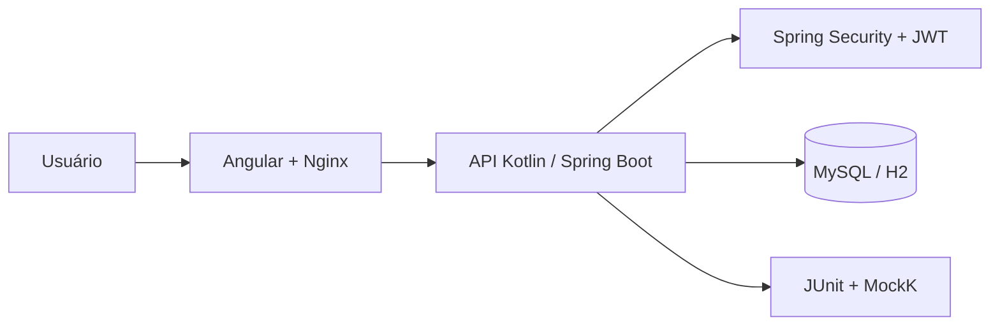

<div align="center">

[English](README.md) | **Português**

</div>

# OpsGuard Platform — Sistema de Gestão Full Stack

Aplicação web para administrar organizações, colaboradores e dispositivos, com autenticação JWT e isolamento de dados por perfil. O projeto contém uma API Kotlin/Spring Boot, um SPA Angular e uma infraestrutura Docker Compose pronta para Windows, Linux e macOS.

## Arquitetura em uma visão



## O que o sistema faz

- Autentica usuários dos perfis `MANAGER` e `OPERATOR`.
- Gerencia organizações, colaboradores e dispositivos.
- Restringe operadores aos dados da própria organização no back-end.
- Valida dados no navegador, na API e no banco de dados.
- Expõe documentação OpenAPI apenas quando habilitada.
- Oferece interface responsiva para desktop, tablet e celular.

## Arquitetura

```text
Navegador
   │
   ▼
Angular + Nginx :4200
   │ /api (proxy interno)
   ▼
Spring Boot :8080
   │ JPA + Flyway
   ▼
MySQL 8.4 :3307 (somente localhost)
```

No desenvolvimento local, o Angular também encaminha `/api` para `127.0.0.1:8080`. Dessa forma, nenhuma URL do computador do desenvolvedor fica compilada no front-end.

## Tecnologias

| Camada | Tecnologia |
|---|---|
| Front-end | Angular 21.2, TypeScript 5.9, RxJS |
| Back-end | Kotlin 2.1, Spring Boot 3.4, Spring Security |
| Autenticação | JWT assinado com HMAC-SHA256, BCrypt 12 |
| Persistência | Spring Data JPA, Hibernate, Flyway |
| Bancos | MySQL 8.4 no Docker e H2 em memória no perfil local |
| Documentação | Springdoc OpenAPI |
| Infraestrutura | Docker Compose, Nginx sem privilégios |
| Testes | JUnit 5, MockK e Spring Test |

## Início rápido com Docker

### Pré-requisitos

- Docker Desktop ou Docker Engine com Docker Compose v2.
- Git.

### 1. Configure o ambiente

Clone o repositório e crie o arquivo local de configuração:

```bash
git clone https://github.com/samuelhfdias-prog/Teste-Rodojacto.git
cd Teste-Rodojacto
cp .env.example .env
```

No PowerShell, use:

```powershell
Copy-Item .env.example .env
```

Edite `.env` e substitua todos os valores iniciados por `troque-`. Gere uma chave JWT Base64 com pelo menos 256 bits:

```bash
openssl rand -base64 32
```

O arquivo `.env` é ignorado pelo Git e nunca deve ser commitado.

### 2. Suba a aplicação

```bash
docker compose up --build -d
docker compose ps
```

Serviços padrão:

| Serviço | Endereço |
|---|---|
| Aplicação web | http://localhost:4200 |
| API | http://localhost:8080/api/health |
| Swagger, se habilitado | http://localhost:8080/swagger-ui.html |
| MySQL | `127.0.0.1:3307` |

Para acompanhar a inicialização:

```bash
docker compose logs -f backend frontend
```

Para encerrar sem apagar os dados:

```bash
docker compose down
```

Para também apagar o volume do banco, use `docker compose down -v`. Essa operação remove os dados definitivamente.

## Desenvolvimento local

### Requisitos

- JDK 21 em `JAVA_HOME` ou disponível no `PATH`.
- Node.js 22 LTS.
- npm 10 ou superior.

Não é necessário instalar Gradle: o wrapper oficial acompanha o projeto.

### Back-end

Windows:

```powershell
cd backend
.\gradlew.bat bootRun
```

Linux ou macOS:

```bash
cd backend
chmod +x gradlew
./gradlew bootRun
```

O perfil local usa H2 em memória, executa as migrações Flyway e habilita o seed de demonstração. Os dados são recriados ao reiniciar a aplicação.

### Front-end

Em outro terminal:

```bash
cd frontend
npm ci
npm start
```

Acesse http://localhost:4200. O proxy de desenvolvimento encaminha chamadas `/api` para o back-end local.

### Credenciais somente para o perfil local

| Usuário | Senha | Perfil |
|---|---|---|
| `manager@opsguard.dev` | `Manager@123` | MANAGER |
| `operator1@opsguard.dev` | `Operator@123` | OPERATOR |
| `operator2@opsguard.dev` | `Operator@123` | OPERATOR |

No Docker, as senhas são obtidas de `SEED_MANAGER_PASSWORD` e `SEED_OPERATOR_PASSWORD`. O seed deve ficar desabilitado em produção.

## Variáveis de ambiente

| Variável | Obrigatória no Docker | Finalidade |
|---|---:|---|
| `MYSQL_PASSWORD` | Sim | Senha do usuário da aplicação no MySQL |
| `MYSQL_ROOT_PASSWORD` | Sim | Senha administrativa do MySQL |
| `JWT_SECRET_KEY` | Sim | Chave Base64 usada para assinar JWTs |
| `JWT_EXPIRATION_MS` | Não | Duração do token; padrão de 1 hora |
| `SEED_DATA_ENABLED` | Não | Habilita usuários/dados de demonstração |
| `SEED_MANAGER_PASSWORD` | Se o seed estiver ativo | Senha do manager de demonstração |
| `SEED_OPERATOR_PASSWORD` | Se o seed estiver ativo | Senha dos operadores de demonstração |
| `SWAGGER_ENABLED` | Não | Habilita OpenAPI/Swagger; padrão `false` no Docker |
| `CORS_ALLOWED_ORIGINS` | Não | Origens separadas por vírgula para acesso direto à API |
| `APP_LOG_LEVEL` | Não | Nível de log da aplicação; padrão `INFO` |
| `SHOW_SQL` | Não | Loga SQL no perfil local quando `true` |

As portas externas também podem ser alteradas com `MYSQL_HOST_PORT`, `BACKEND_HOST_PORT` e `FRONTEND_HOST_PORT`.

## API

### Autenticação

```http
POST /api/auth/login
Content-Type: application/json

{
  "email": "manager@opsguard.dev",
  "password": "sua-senha"
}
```

O token retornado deve ser enviado em `Authorization: Bearer <token>`.

### Recursos

| Método | Rota | Descrição |
|---|---|---|
| GET | `/api/organizations` | Lista organizações permitidas |
| GET | `/api/organizations/{id}` | Obtém uma organização |
| POST | `/api/organizations` | Cria organização; somente MANAGER |
| PUT | `/api/organizations/{id}` | Atualiza organização; somente MANAGER |
| DELETE | `/api/organizations/{id}` | Exclui organização; somente MANAGER |
| GET/POST | `/api/collaborators` | Lista ou cria colaboradores |
| GET/PUT/DELETE | `/api/collaborators/{id}` | Consulta, altera ou exclui colaborador |
| GET/POST | `/api/devices` | Lista ou cria dispositivos |
| GET/PUT/DELETE | `/api/devices/{id}` | Consulta, altera ou exclui dispositivo |
| GET | `/api/health` | Verificação pública de saúde |

### Controle de acesso

| Operação | MANAGER | OPERATOR |
|---|---:|---:|
| Visualizar organizações | Todas | Somente a própria |
| Criar, editar ou excluir organização | Sim | Não |
| Visualizar colaboradores/dispositivos | Todos | Somente os da própria organização |
| Criar colaboradores/dispositivos | Em qualquer organização | Sempre na própria organização |
| Alterar ou excluir dados de outra organização | Sim | Não, retorna HTTP 403 |

As regras são aplicadas nos serviços do back-end. Ocultar botões no front-end é apenas uma melhoria de experiência e não constitui a barreira de segurança.

## Segurança implementada

- JWT com emissor obrigatório, expiração, identificador único e chave externa no Docker.
- Senhas armazenadas com BCrypt fator 12.
- Bloqueio temporário após cinco falhas de login por e-mail em 15 minutos.
- Mensagens uniformes para credenciais inválidas, sem revelar usuários existentes.
- Respostas JSON consistentes para 401, 403, 409, 422 e 429.
- CORS restrito e configurável; credenciais cross-origin desabilitadas.
- Validação de tamanho, formato, campos obrigatórios e IDs positivos.
- Normalização de e-mails, identificadores e textos antes da persistência.
- Headers CSP, `frame-ancestors`, `nosniff`, política de referência e permissões no Nginx.
- Contêineres sem privilégios adicionais; front-end e back-end executados como usuários não root.
- Banco exposto apenas em `127.0.0.1` por padrão.
- Swagger desabilitado por padrão no Docker.
- Segredos, chaves e arquivos de ambiente ignorados pelo Git.
- Token mantido em `sessionStorage`, validado antes da restauração e removido em respostas 401.

Para produção real, termine TLS no proxy/balanceador, mantenha segredos em um cofre, deixe o seed e Swagger desabilitados, restrinja a porta direta da API e use um limitador distribuído (por exemplo, Redis) se houver múltiplas instâncias. O limitador incluído é local a cada instância.

## Testes e verificações

Back-end:

```bash
cd backend
./gradlew test
```

No Windows, substitua por `.\gradlew.bat test`.

Front-end:

```bash
cd frontend
npm ci
npm run build
npm audit
```

Infraestrutura:

```bash
docker compose config
docker compose build
```

## Estrutura principal

```text
.
├── .env.example
├── docker-compose.yml
├── backend
│   ├── gradlew / gradlew.bat
│   ├── build.gradle.kts
│   └── src
│       ├── main/kotlin/com/rodojacto
│       │   ├── auth
│       │   ├── config
│       │   ├── domain
│       │   ├── exception
│       │   └── security
│       ├── main/resources/db/migration
│       └── test/kotlin
└── frontend
    ├── proxy.conf.json
    ├── nginx.conf
    └── src/app
        ├── core
        ├── features
        └── shared
```

## Solução de problemas

- `JAVA_HOME is not set`: instale o JDK 21 e configure `JAVA_HOME`, ou adicione `java` ao `PATH`.
- Porta em uso: altere as variáveis `*_HOST_PORT` no `.env`.
- Docker recusa iniciar por variável ausente: copie `.env.example` para `.env` e substitua os placeholders.
- Front-end local retorna erro de API: confirme que o back-end está em `127.0.0.1:8080`.
- Token expirado: a sessão é removida automaticamente; faça login novamente.
- Mudou uma migração já aplicada: crie uma nova versão Flyway em vez de editar uma migração executada.

## Licença e contexto

Projeto apresentado como plataforma de portfólio para gestão operacional segura. Antes de uso comercial, defina uma licença explícita e revise as políticas de segurança e retenção de dados da organização.
